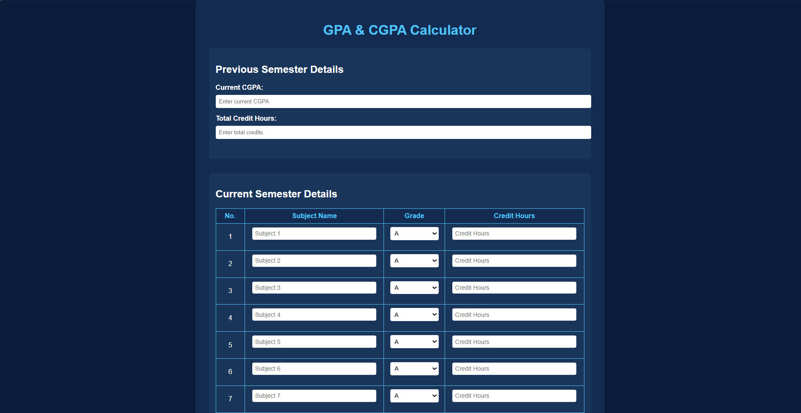

# GPA & CGPA Calculator



This web application provides an interactive GPA and CGPA calculator for students. It allows users to input their semester grades and credit hours and calculates their GPA for the current semester as well as their updated cumulative GPA (CGPA).

## Features

- **Dynamic Input for Subjects:** Add up to 10 subjects with grades and credit hours.
- **Customizable Grade Points:** Supports a variety of grading systems (e.g., A, B+, B, etc.).
- **Interactive Results:** Displays a detailed breakdown of the calculations, including grade points and total credits.
- **Previous Semester Integration:** Optionally include your previous CGPA and total credit hours to calculate the updated CGPA.
- **Print Results:** Allows printing of calculated results for record-keeping.
- **User-Friendly Design:** Built with a responsive and visually appealing interface.

## Technologies Used

- **HTML5:** Markup structure for the app.
- **CSS3:** Styling for a clean and responsive design.
- **JavaScript:** Core logic for GPA and CGPA calculations.

## Installation

1. Clone the repository:
   ```bash
   git clone https://github.com/your-username/gpa-cgpa-calculator.git
2. Navigate to the project directory:
   ```bash
   cd gpa-cgpa-calculator
3.Open the index.html file in a web browser to start using the application.

## Usage

1. Enter your current CGPA and total credit hours (if applicable).
2. Fill in the subject details for the current semester:
- Subject name
- Grade (from a dropdown menu)
- Credit hours
3. Click Calculate Results to see your GPA and updated CGPA.
4. Use the Print Results button to print or save a copy of your results.
